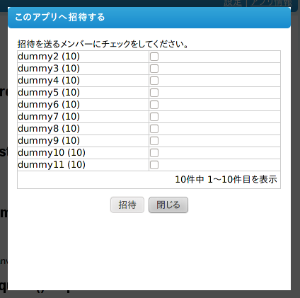

============
opensocial.*
============

opensocial.getEnvironment()
===========================

.. js:function:: opensocial.getEnvironment()

  :returns: :js:class:`opensocial.Environment`

アプリが実行されている環境の情報を取得します。サポートされているプロフィールのフィールドを調べる場合などに使用できます。詳しくは :js:class:`opensocial.Environment` を参照して下さい。

opensocial.hasPermission()
==========================

.. js:function:: opensocial.hasPermission(permission)

  :param opensocial.Permission permission: 確認する対象となるアクセス権
  :returns: アクセス権を持っていれば true、そうでなければ false。

**実装されていません** 実行中のアプリが ``permission`` に対するアクセス権を持っているかどうかを調べます。

opensocial.invalidateCache()
============================

.. js:function:: opensocial.invalidateCache()

実行中のアプリで VIEWER が現在までに生成したキャッシュを無効化します。このメソッドを実行するとそれ以前のキャッシュは使用されなくなります (キャッシュ機能自体が無効になるという意味ではありません)。

opensocial.requestPermission()
==============================

.. js:function:: opensocial.requestPermission(permissions, reason[, opt_callback])

  :param Array.<opensocial.Permission> permissions: 要求するアクセス権
  :param String reason: 要求する理由 (ユーザーに対して表示される)
  :param Function opt_callback: コールバック

**実装されていません** ユーザーに対して ``permission`` のアクセス権の許可を求めます。

opensocial.requestShareApp()
============================

.. js:function:: opensocial.requestShareApp(recipients, reason[, opt_callback[, opt_params]])

  :param opensocial.IdSpec recipients: リクエストの送信先
  :param opensocial.Message reason: リクエストの送信理由 (ユーザーに対して表示される)
  :param Function opt_callback: コールバック
  :param opensocial.NavigationParameters opt_params: **実装されていません** リクエストの作成時・承認時にユーザーを移動させるためのパラメータ

``recipients`` で指定したユーザーにアプリを招待します。

送信前に下図のような送信先の選択画面 (``recipients`` に含まれるメンバーから送信先を選択できる) が表示されます。

.. これより下は OpenSocial 1.0 以降で廃止

opensocial.newActivity()
========================

.. js:function:: opensocial.newActivity(params)

  :param Map.<opensocial.Activity.Field|Object> params: 作成するアクティビティのパラメータ
  :returns: :js:class:`opensocial.Activity`

新規に :js:class:`opensocial.Activity` オブジェクトを作成します。パラメータに使用できるフィールドの一覧は :js:class:`opensocial.Activity.Field` を参照して下さい。なお :js:data:`opensocial.Activity.Field.TITLE` は必須フィールドとなっています。

作成したアクティビティをSNSへ送信するためにはさらに :js:func:`opensocial.requestCreateActivity` を呼び出す必要があります。

opensocial.newAlbum()
=====================

.. js:function:: opensocial.newAlbum([opt_params])

  :param Map.<opensocial.Album.Field|Object> opt_params: 作成するアルバムのパラメータ
  :returns: :js:class:`opensocial.Album`

新規に :js:class:`opensocial.Album` オブジェクトを作成します。パラメータに使用できるフィールドの一覧は :js:class:`opensocial.Album.Field` を参照して下さい。

ただし、現バージョンの opOpenSocialPlugin はアルバムの作成に対応していないため、現時点では作成したオブジェクトを使うことができません。

opensocial.newDataRequest()
===========================

.. js:function:: opensocial.newDataRequest()

  :returns: :js:class:`opensocial.DataRequest`

新規に :js:class:`opensocial.DataRequest` オブジェクトを作成します。DataRequestを使用してSNSに対してリクエストを送信する場合は最初にこのメソッドを実行します。

opensocial.newIdSpec()
======================

.. js:function:: opensocial.newIdSpec(parameters)

  :param Map.<opensocial.IdSpec.Field|Object> parameters: 作成する IdSpec オブジェクトのパラメータ
  :returns: :js:class:`opensocial.IdSpec`

新規に :js:class:`opensocial.IdSpec` オブジェクトを作成します。パラメータに使用できるフィールドは :js:class:`opensocial.IdSpec.Field` を参照して下さい。

opensocial.newMediaItem()
=========================

.. js:function:: opensocial.newMediaItem(mimeType, url[, opt_params])

  :param String mimeType: メディアの MIME type
  :param String url: メディアのURL
  :param Map.<opensocial.MediaItem.Field|Object> opt_params: 作成するメディアのパラメータ
  :returns: :js:class:`opensocial.MediaItem`

新規に :js:class:`opensocial.MediaItem` オブジェクトを作成します。パラメータに使用できるフィールドは :js:class:`opensocial.MediaItem.Field` を参照して下さい。

opensocial.newMessage()
=======================

.. js:function:: opensocial.newMessage(body[, opt_params])

  :param String body: 作成するメッセージの本文
  :param Map.<opensocial.Message.Field|Object> opt_params: 作成するメッセージのパラメータ
  :returns: :js:class:`opensocial.Message`

新規に :js:class:`opensocial.Message` オブジェクトを作成します。パラメータに使用できるフィールドは :js:class:`opensocial.Message.Field` を参照して下さい。

ただし、現バージョンの opOpenSocialPlugin はメッセージの送信に対応していないため、現時点では作成したオブジェクトを使うことができません。

opensocial.newNavigationParameters()
====================================

.. js:function:: opensocial.newNavigationParameters(parameters)

  :param Map.<opensocial.NavigationParameters.Field|Object> parameters: 作成する NavigationParameters オブジェクトのパラメータ
  :returns: :js:class:`opensocial.NavigationParameters`

新規に :js:class:`opensocial.NavigationParameters` オブジェクトを作成します。パラメータに使用できるフィールドは :js:class:`opensocial.NavigationParameters.Field` を参照して下さい。

opensocial.requestCreateActivity()
==================================

.. js:function:: opensocial.requestCreateActivity(activity, priority[, opt_callback])

  :param opensocial.Activity activity: 送信するアクティビティ
  :param opensocial.CreateActivityPriority priority: アクティビティの優先度
  :param Function opt_callback: コールバック

アクティビティを送信します。送信に使用する :js:class:`opensocial.Activity` オブジェクトは :js:func:`opensocial.newActivity()` メソッドを使用して生成して下さい。

アクティビティに設定できる優先度は :js:class:`opensocial.CreateActivityPriority` を参照して下さい。

opensocial.requestSendMessage()
===============================

.. js:function:: opensocial.requestSendMessage(An, message[, opt_callback[, opt_params]])

  :param opensocial.IdSpec An: メッセージの送信先
  :param opensocial.Message message: 送信するメッセージ
  :param Function opt_callback: コールバック
  :param opensocial.NavigationParameters opt_params: メッセージの作成時・承認時にユーザーを移動させるためのパラメータ

**実装されていません** メッセージを送信します。送信に使用する :js:class:`opensocial.Message` オブジェクトは :js:func:`opensocial.newMessage()` メソッドを使用して生成して下さい。

opensocial.requestUploadMediaItem()
===================================

.. js:function:: opensocial.requestUploadMediaItem(albumId[, opt_callback])

**実装されていません** アルバムに画像をアップロードするためのUIを表示します。

