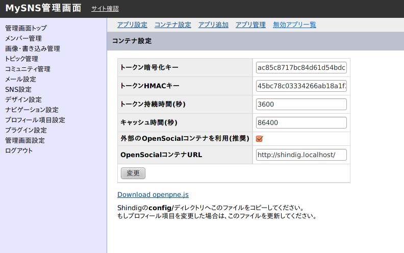

.. _setup:

============
セットアップ
============

この章では、SNSおよびOpenSocialコンテナ設置者向けのの情報を提供します。

opOpenSocialPlugin を正常に動作させるには、OpenPNE3が必要な環境に加え以下の環境がSNSサーバに備えられている必要があります。

 * PHPのopenssl拡張

署名用の鍵を作成する
====================

SNSが、アプリケーション開発者のサーバなどにHTTPリクエストを送信する際は、 :ref:`署名<signature>` (OAuth Signature)をリクエストパラメータやHTTPヘッダに付加します。その際に、RSA秘密鍵とCSRが必要になるため、事前に作成する必要があります。

以下の手順で作成することが出来ます。

OpenPNEのディレクトリのトップに移動し、以下のタスクを実行します。

::

  $ php symfony opOpenSocial:generate-key

秘密鍵とCSRの作成に必要な情報（有効期限、キーフレーズ、国コード、所在地など）等を入力します。入力が終わると、 *plugins/opOpenSocialPlugin/certs* 下に鍵が作成されます。また、 http://sns.example.com/opensocial/certificates でCSRを見ることが出来ます。

署名の検証法は :ref:`こちら<signature>` を御覧下さい。

定期的にライフサイクルイベントを送信するようにする
==================================================

opOpenSocialPlugin ではライフサイクルイベントによるリクエストに対応していますが、特定のイベントが発生した時点ではすぐにリクエストは送信されません。特定のイベントが発生したときはキューに蓄積され、定期的に実行されるタスクによって一度に送信されます。

ライフサイクルイベントの送信をするためには、SNS設置者が ``/etc/crontab`` 等に以下のような行を追加する必要があります。

::

  0 * * * * root cd #OPENPNE_DIR# && php symfony opOpenSocial:execute-lifecycle-event --limit-request=1000

**#OPENPNE_DIR#** はOpenPNEのディレクトリを指定して下さい。

このタスクの実行で大量のリクエストを処理すると、送信元のサーバーに極端な負荷が掛かる場合があります。これを防止するために、オプションで1回ごとに送出されるリクエストの数を制限することができます。負荷の状況などにあわせて設定して下さい。

--limit-request=N       1回の実行ごとに送信されるリクエスト数の上限
--limit-request-app=N   1つのアプリごとに送信されるリクエスト数の上限

``--limit-request-app`` オプションは、特定のアプリに対してライフサイクルイベントが大量に溜まっている状況などに有効です。

コンテナサーバーを外部に設置する
================================

ガジェットアプリやAPIはOpenPNE3にopOpenSocialPluginを導入することで利用できます。ただし、本番環境での利用にはそのままでは問題があります。なぜならば、初期の状態では、JavaScriptのコードを含むガジェットアプリケーションがOpenPNE3と同一ドメイン上で実行されるため、セキュリティ上の問題が起きる可能性が生じてしまいます。よって、本番運用ではコンテナサーバを外部ドメイン上に設置する必要があるのです。

コンテナサーバーを外部に設置するためにはいくつか設定を行う必要があります。その場合、SNSサーバ・コンテナサーバは共に、PHPのmcrypt拡張, curl拡張, openssl拡張を導入している必要があります。

opOpenSocialPluginで、対応しているコンテナはShindig-1.1-BETA5以上を必要としています。

Shindig-1.1-BETA5を利用する場合、 http://incubator.apache.org/shindig/developers/php/build.html に従い下記のようにセットアップして下さい。

:: 

  $ mkdir /var/www/html/shindig
  $ cd /var/www/html/shindig
  $ svn co http://svn.apache.org/repos/asf/shindig/tags/shindig-project-1.1-BETA5-incubating/ .

また、 `署名用の鍵を作成する`_ で作成した鍵はShindigのディレクトリの *php/certs/* へコピーして下さい。

OpenPNEの設定
-------------

openpne.js
~~~~~~~~~~

OpenPNEの管理画面から、 :menuselection:`プラグイン設定 --> opOpenSocialPluginの設定 --> コンテナ設定` にアクセスします。

「外部のOpenSocialコンテナを利用(推奨)」にチェックを入れ、OpenSocialコンテナURLに、上記で用意したコンテナのURLを設定します。

設定変更後、「Download openpne.js」が表示されます。そのファイルをダウンロードし、 Shindigのディレクトリの *config/* 内に設置してください。

このファイルは、利用できるプロフィール項目の情報を含むためプロフィールを追加、削除した場合は再度上書きするようにしてください。

OpenPNEService.php
~~~~~~~~~~~~~~~~~~

OpenPNEのディレクトリ中の、 *plugins/opOpenSocialPlugin/lib_for_shindig/OpenPNEService.php.sample* を、 *OpenPNEService.php* という名前でコピーしてShindigがロードできる場所に設置してください。

また、ファイルを開き以下の箇所を設定してください。::

  const SNSURL          = '#SNS_URL#';

例 ::

  const SNSURL          = 'http://sns.example.com/';

*#SNS_URL#* はSNS自体のURLを最後はスラッシュで終わるように設定してください。

Shindigの設定
-------------

Shindigのディレクトリの *php/config/* に、 *local.php* を作成し、以下のように設定してください。

例::

  <?php

  $shindigConfig = array(
    'debug' => false,

    'allow_plaintext_token' => false,
    'render_token_required' => true,
    'allow_anonymous_token' => false,

    'token_cipher_key' => '#TOKEN_CIPHER_KEY#',
    'token_hmac_key'   => '#TOKEN_HMAC_KEY#',
    'private_key_phrase'    => '#KEY_PHRASE#',
    'extension_class_paths' => '#EXTENSION_CLASS_PATH#',
    'extension_autoloader'  => true,
    'person_service'     => 'OpenPNEService',
    'activity_service'   => 'OpenPNEService',
    'app_data_service'   => 'OpenPNEService',
    'messages_service'   => 'OpenPNEService',
    'album_service'      => 'OpenPNEService',
    'media_item_service' => 'OpenPNEService',
  );

*#TOKEN_CIPHER_KEY#* と、 *#TOKEN_HMAC_KEY#* には、コンテナ設定画面にある、「トークン暗号化キー」と「トークンハッシュ化キー」をそれぞれ設定してください。 *#KEY_PHRASE#* には、秘密鍵のキーフレーズを指定し、 *#EXTENSION_CLASS_PATH#* には、上記で作成した、 *OpenPNEService.php* のあるディレクトリを指定してください。
