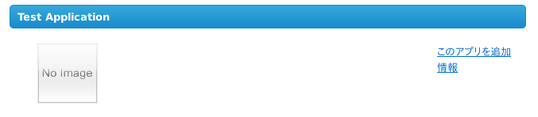
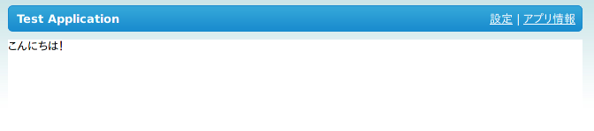
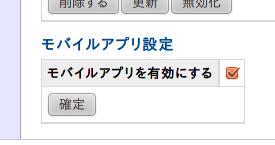

.. _use_application:

====================================
OpenSocialアプリケーションを利用する
====================================

SNSのメンバーがOpenSocialアプリケーション (以下、OpenSocialアプリ) を利用できるようにするには事前にSNSにOpenSocialアプリを登録する必要があります。
ここでは、OpenPNE3にOpenSocialアプリを登録してメンバーが利用するまでの手順を説明します。

SNSにアプリを登録する
=====================

OpenSocialアプリの登録は管理画面の プラグイン設定 > opOpenSocialPluginの設定 > アプリ追加 から行うことができます。登録するアプリは URL で指定します。
ここではOpenSocialアプリの例として https://gist.github.com/raw/951203/os_sample.xml を使用します。

アプリの登録時にエラーが出る場合は、URLが正しいかどうかやOpenPNE3で利用できないフィーチャーが使われていないかなどを確認して下さい。

アプリの作成方法についてはこのドキュメントの「アプリ開発者向け」の章を参照して下さい。

アプリを使用する
================

SNSに登録されたアプリはメンバーが追加をするまで実行されません。登録されたアプリはSNSの「アプリギャラリー」に表示され、ここからメンバーがアプリを選んで利用することができます。

.. note::
  ここでの「アプリの追加」は先ほど管理画面で行ったアプリの追加 (登録) とは別の手順で、SNSに登録されたアプリの中からメンバーがアプリを選んで利用を開始することを指します。画面上ではどちらも「アプリを追加」となっているため注意して下さい。

SNSにログインしてホーム画面より アプリ > アプリギャラリー からアプリギャラリーのページを開くと、下図のように登録したアプリが表示されます。

「このアプリを追加」をクリックすると確認画面が表示されます。「はい」をクリックして下図のようにアプリが正常に表示されれば成功です。

正しく表示されなかった場合は :ref:`セットアップ<setup>` に戻って再度OpenPNEやShindigの設定を確認して下さい。

モバイルアプリを有効にする
==========================

opOpenSocialPlugin はモバイル向けのOpenSocialアプリにも対応しています。デフォルトではこの機能は無効になっているため、管理画面の プラグイン設定 > opOpenSocialPluginの設定 より「モバイルアプリを有効にする」にチェックを入れてください。

アプリの登録方法は `SNSにアプリを登録する`_ と同じ手順です。モバイル対応アプリを登録し終えた後は、アプリ詳細の画面のモバイルアプリ設定より「モバイルアプリを有効にする」を有効にして下さい (下図)。この設定が表示されない場合、登録されたアプリはモバイル対応アプリとして認識されていません。 :ref:`Gadget <gadget>` の頁を読み、 `<Content type="url" view="mobile" href="...">` のようなタグが含まれているかどうか再度確認して下さい。

